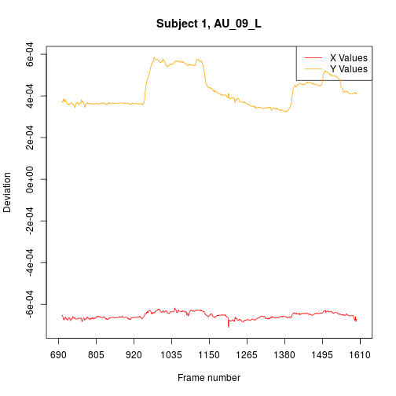
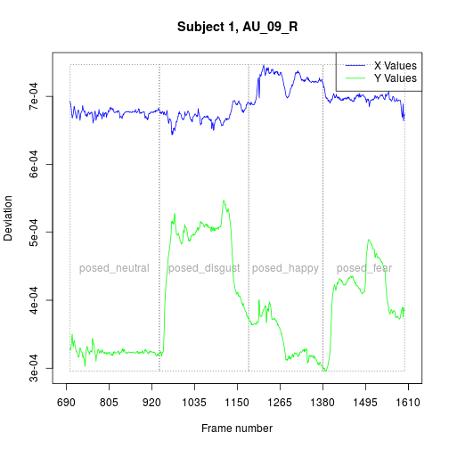
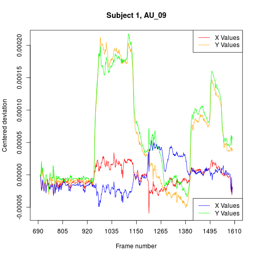
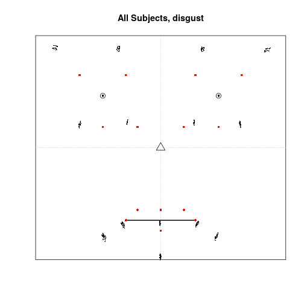

# Workflow of Blender-data post-processing with the blenderFace package 

For using the blenderFace package it is assumed, that you have tracked facial movements for at least two subjects, following the "Step_by_Step_Instructions.pdf". The output of this procedure is a csv file for each participant, which includes the x,y,z-axis movement of the tracked facial markers. Additionally, you need to mark the frames for which a stimulus was presented to the participants. This must be done for each participant (a.k.a. csv file) in a column called "Stimulustype" which marks the frames for which a stimulus was presented to the participant (e.g., "posing happiness" or viewing an emotion eliciting film clip). Unfortunately, there is no function or procedure that helps you with this step, because it strongly depends on how you presented the stimuli and how you recorded the video clips of the participants. If you know the start- and stop-frames of the presented stimuli, for example, by recording the computer screen via a mirror in the back of the participant, you can fill in  the stimulustype-colums by hand using a spreadsheet programm. 

The blenderFace package contains raw data sets of two subjects (in fact, it is one subject recorded and tracked twice) which already have the stimulustype-column attached. 

First, be sure to have installed and loaded the package:

```r
install.packages("devtools")
library(devtools)
install_github("axzinker/blenderFace", built_vignettes = TRUE)
library(blenderFace)
```


@Axel: fix me: Übersicht über generellen Ablauf der Funktionen, Aufzählung


## Concatenating raw data files to one large RData file with the function *concatBlenderFiles*

To perform the concatenation of files, use the *concatBlenderFiles* function of the package. If you have followed the "Step-by-Step"-instructions, the subject number is part of the file name. However, the file name ends with "_Step_03" for each participant. Please rename the files, so that the subject number is the last number before the filetype ending (e.g., ".csv"). For example, if you have the file "Subject_39_Step_03.csv", rename it into "Subject_39.csv". The package includes two sample csv files in the `./inst/extdata` directory ("Subject_01.csv","Subject_02.csv"). Although the *concatBlenderFiles* function does some basic input checks, be aware that this function writes on your hard disk and may change/overwrite/delete files, if messed up input strings are given!

The path specifications are adapted for the package example. Please change the paths to your needs.


```r
inputdir <- paste(system.file(package = "blenderFace"),"/extdata/",sep="")
outputdir <- paste(system.file(package = "blenderFace"),"/data/",sep="")
filenames <- c("Subject_01.csv","Subject_02.csv")

# If all files in a directory should be processes, use:
# filenames <- list.files(inputdir, pattern = paste("[0-9]",".csv","$",sep=""))

concatBlenderFiles(dataFileNames = filenames, inputDirectory = inputdir, subjectColumn = FALSE, outputFilename = "rawdata.rda", outputDirectory = outputdir, verbose = TRUE)
```

The console output of the *concatBlenderFiles* function shows:


```r
Step 1: Determing unique column names and number of rows of the files to be concatenated.
Reading 2 files:
Reading file Subject_01.csv (1/2)
  Adding 1714 rows to data frame of actually 0 rows.
Reading file Subject_02.csv (2/2)
  Adding 1692 rows to data frame of actually 1714 rows.

The final data frame will have 51 columns and 3406 rows.

These are the unique column names of all files to be concatenated. Check, if they are correct.
 [1] "AU_01_L_x"    "AU_01_L_y"    "AU_01_L_z"    "AU_01_R_x"    "AU_01_R_y"    "AU_01_R_z"    "AU_02_L_x"    "AU_02_L_y"    "AU_02_L_z"   
[10] "AU_02_R_x"    "AU_02_R_y"    "AU_02_R_z"    "AU_06_L_x"    "AU_06_L_y"    "AU_06_L_z"    "AU_06_R_x"    "AU_06_R_y"    "AU_06_R_z"   
[19] "AU_08_x"      "AU_08_y"      "AU_08_z"      "AU_09_L_x"    "AU_09_L_y"    "AU_09_L_z"    "AU_09_R_x"    "AU_09_R_y"    "AU_09_R_z"   
[28] "AU_10_L_x"    "AU_10_L_y"    "AU_10_L_z"    "AU_10_R_x"    "AU_10_R_y"    "AU_10_R_z"    "AU_11_L_x"    "AU_11_L_y"    "AU_11_L_z"   
[37] "AU_11_R_x"    "AU_11_R_y"    "AU_11_R_z"    "AU_12_L_x"    "AU_12_L_y"    "AU_12_L_z"    "AU_12_R_x"    "AU_12_R_y"    "AU_12_R_z"   
[46] "AU_16_x"      "AU_16_y"      "AU_16_z"      "Frame"        "Stimulustype"
Abort Script? (Press 'y' to abort, or any other key to coninue)
? 
Step 2: Concatenating files.

Preallocating data frame of a 51x3406 matrix.
Concatenating file Subject_01.csv (1/2)
Concatenating file Subject_02.csv (2/2)
Step 3: Saving output file (it takes time to save large files).
```

As main output of this function a file with the filename given in `outputFilename` is saved in the directory given in as `outputDirectory`. The data frame stored in this file contains the data of all concatenated subjects. This output file of the two sample subjects is also attached to this package and labeled `rawdata`.

Finally, check if the names for the "Stimulustype" column are euqal for all cases, e.g., they do not contain misspellings. If not, perform the corrections in the corresponding csv files of the participants.


```r
table(rawdata$Stimulustype, rawdata$subject)
```

```
##                
##                   1   2
##                 863 791
##   posed_disgust 215 240
##   posed_fear    235 220
##   posed_happy   215 200
##   posed_neutral 186 241
```

## Scale Blender units to millimeter by using the function *bu2mm*

The next step in Blender data post-processing is to scale the Blender units (BU) into mm. In principle, the rescaling is done by the rule of proportion:
$$
\begin{equation*}
  \frac{\mbox{Diameter in Blender units}}{\mbox{Diameter in millimeter}} =
  \mbox{Factor to divide BU by, to obtain mm}
\end{equation*}
$$

For example, a glue dot has a diameter of 8 mm and is measured in Blender with a diameter of 1 BU:

$$
\begin{equation*}
  \frac{1 \mbox{ BU}}{8 \mbox{ mm}} = 0.125 \\
  \frac{2 \mbox{ BU}}{0.125} = 16 \mbox{ mm}
\end{equation*}
$$

In the sample videos "Subject_01.mp4" and "Subject_02.mp4" glue-dots with 8 mm diameter were used. To perform the rescaling for the `rawdata` dataset, the glue-dot diameter measurements in BU for each participant are needed. If you have followed the "Step-by-Step"-instructions, you have measured and saved the glue-dot diameters in BU in a file called "Blender_Scalingdata.csv". For the two example subjects, the file "Blender_Scalingdata.csv" is included in the package and should be loaded to get the scaling parameters. Please note, that the paths used in the example below are specified for the package datasets. Therefore, adapt the paths matching your work environment accordingly.


```r
# Load the file "Blender_Scalingdata.csv"
scaledata <- read.csv(system.file("extdata", "Blender_Scalingdata.csv", package = "blenderFace"), header = TRUE, sep =",")
# Be sure to have the data sorted by subjects
scaledata <- scaledata[with(scaledata, order(scaledata$subject)), ]

# Load the file "rawdata"
data(rawdata, package="blenderFace") # for the package example, please comment out
# load("path/to/your/directory/rawdata.rda") # uncomment and adapt to your work environment
# Be sure to have the data sorted by subjects
rawdata <- rawdata[with(rawdata, order(rawdata$subject)), ]
```

From the loaded data files the relevant information for the *bu2mm* function has to be extracted:


```r
# Geting the column names of the scaledata dataframe
names(scaledata)
```

```
## [1] "subject"                           
## [2] "GlueDotDiameter"                   
## [3] "PupilPupilDistance"                
## [4] "MouthcornerMouthcornerDistance"    
## [5] "LeftPupilLeftMouthcornerDistance"  
## [6] "RightPupilRightMouthcornerDistance"
## [7] "Comment"
```

```r
# Determin the dataframe columns which should be scaled:
names(rawdata)
```

```
##  [1] "AU_01_L_x"    "AU_01_L_y"    "AU_01_L_z"    "AU_01_R_x"   
##  [5] "AU_01_R_y"    "AU_01_R_z"    "AU_02_L_x"    "AU_02_L_y"   
##  [9] "AU_02_L_z"    "AU_02_R_x"    "AU_02_R_y"    "AU_02_R_z"   
## [13] "AU_06_L_x"    "AU_06_L_y"    "AU_06_L_z"    "AU_06_R_x"   
## [17] "AU_06_R_y"    "AU_06_R_z"    "AU_08_x"      "AU_08_y"     
## [21] "AU_08_z"      "AU_09_L_x"    "AU_09_L_y"    "AU_09_L_z"   
## [25] "AU_09_R_x"    "AU_09_R_y"    "AU_09_R_z"    "AU_10_L_x"   
## [29] "AU_10_L_y"    "AU_10_L_z"    "AU_10_R_x"    "AU_10_R_y"   
## [33] "AU_10_R_z"    "AU_11_L_x"    "AU_11_L_y"    "AU_11_L_z"   
## [37] "AU_11_R_x"    "AU_11_R_y"    "AU_11_R_z"    "AU_12_L_x"   
## [41] "AU_12_L_y"    "AU_12_L_z"    "AU_12_R_x"    "AU_12_R_y"   
## [45] "AU_12_R_z"    "AU_16_x"      "AU_16_y"      "AU_16_z"     
## [49] "Frame"        "Stimulustype" "subject"
```

```r
# -> Frame, Stimulustype and subject should not be scaled -> removed for variable colNames
colNames <- c("AU_01_L_x", "AU_01_L_y", "AU_01_L_z", "AU_01_R_x", "AU_01_R_y", "AU_01_R_z", "AU_02_L_x", "AU_02_L_y", "AU_02_L_z", "AU_02_R_x", "AU_02_R_y", 
              "AU_02_R_z", "AU_06_L_x", "AU_06_L_y", "AU_06_L_z", "AU_06_R_x", "AU_06_R_y", "AU_06_R_z", "AU_08_x", "AU_08_y", "AU_08_z", "AU_09_L_x",  
              "AU_09_L_y", "AU_09_L_z", "AU_09_R_x", "AU_09_R_y", "AU_09_R_z", "AU_10_L_x", "AU_10_L_y", "AU_10_L_z", "AU_10_R_x", "AU_10_R_y", "AU_10_R_z",  
              "AU_12_L_x", "AU_12_L_y", "AU_12_L_z", "AU_12_R_x", "AU_12_R_y", "AU_12_R_z", "AU_16_x", "AU_16_y", "AU_16_z")

# To not overwrite data, use a new data frame (dataSmm means data scaled in millimeter)
dataSmm <- bu2mm(data = rawdata, colNames = colNames, colNameSubj = "subject", scaleFactor = scaledata$GlueDotDiameter, rwMeasure = 8, verbose = TRUE)
```

```
## Perform scaling to millimeter for subject 1 of 2. 
## Perform scaling to millimeter for subject 2 of 2.
```

```r
# Optionally save data at this stage of analysis
# save(dataSmm, file = "path/to/your/directory/dataSmm.rda")
```
<!-- this is necessary to save the data file in /data but not needed in the vignette

```r
devtools::use_data(dataSmm, overwrite = TRUE)
```

```
## Saving dataSmm as dataSmm.rda to /home/axel/Dropbox/015_Artikel/Blender/Supplemental_Material/R_Scripts/blenderFace/data
```
-->


In the output data frame of this function is rescaled, and therefore movements can be interpreted in millimeter.

## Scale facial movements to a standardized face by using the function *face2stdFace*

Sometimes it is useful not to interpret the movements in an absolute measure, such as millimeter, but to be able to compare movements of different face sizes. Imagine, you want to compare the facial expression of a child sample with the facial expression of an adult sample. Because the head sizes of the children are smaller, the facial movements are also smaller, compared to the adult sample. Therefore, the standardization of different face sizes to a standardized face is needed. The function *face2stdFace* performs this step for you. The proportions of the standard face used here are based on biological and artistic resources (*@Rainer: fix me: Literaturangaben?*). In the standardized face the length and the height of the head have each a value of 1, while the left-pupil -- right-pupil distance and the left-pupil -- left-mouth-corner distance are scaled to 1/3rd of the face height and face width.

As individual measures for face width and face height, the individual left-pupil -- right-pupil, and the left-pupil -- left-mouth-corner distances are used. If you have followed the "Step-by-Step"-instructions, you have measured and saved the these distances in BU in a file called "Blender_Scalingdata.csv". To have comparable measures for all subjects, the left-pupil -- right-pupil distance and the left-pupil -- left-mouth-corner distance are set in proportion to 1/3rd to achieve a factor by which the x-axis and the y-axis must be divided, to obtain a standardized scaling. Additionally, if the left-mouth-corner -- right-mouth-corner distance or the right-pupil -- right-mouth-corner distance are given, the *face2stdFace* function allows to compute a mean of these distances for the x-, and the y-axis to have a more reliable distance measure. However, to our experience, the mouth corner distance ist not such an reliable measure as the pupil distance is.

Standardizing the z-axis is not (yet) implemented, mainly due to the lack of an appropriate facial distance measure for scaling the z-axis. As a consequence, at the monment it is not meaningful to rescale the z-axis. Therefore the z-axis is omitted in further analyses.

Again, as in function *bu2mm* the rescaling is done via the rule of proportion. For subject 1 in the example data in the file "Blender_Scalingdata.csv", the left-pupil -- right-pupil distance is measured with 0.3346 BU in Blender. This distance is set in proportion to 1/3 to obtain a scaling factor for the x-axis.
$$
\begin{equation*}
  \frac{0.3346\mbox{ BU}}{0.\bar{3}} = 1.0038
\end{equation*}
$$
as scale factor for the x-axis. The left-pupil -- left-mouth-corner distance for subject 1 is measured with 0.36611 BU. Therefore, the scale factor for the y-axis is
$$
\begin{equation*}
  \frac{0.36611\mbox{ BU}}{0.\bar{3}} = 1.09833
\end{equation*}
$$

If not yet loaded, load the files `scaledata` and `rawdata`  into Rs environment:

```r
# Load the file "Blender_Scalingdata.csv"
scaledata <- read.csv(system.file("extdata", "Blender_Scalingdata.csv", package = "blenderFace"), header = TRUE, sep =",")
# Be sure to have the data sorted by subjects
scaledata <- scaledata[with(scaledata, order(scaledata$subject)), ]

# Load the file "rawdata"
data(rawdata, package="blenderFace") # for the package example, please comment out
# load("path/to/your/directory/rawdata.rda") # uncomment and adapt to your work environment
# Be sure to have the data sorted by subjects
rawdata <- rawdata[with(rawdata, order(rawdata$subject)), ]
```

Subsequently, prepare the parameters and call the function *face2stdFace*:

```r
# Geting the column names of the scaledata dataframe
names(scaledata)
```

```
## [1] "subject"                           
## [2] "GlueDotDiameter"                   
## [3] "PupilPupilDistance"                
## [4] "MouthcornerMouthcornerDistance"    
## [5] "LeftPupilLeftMouthcornerDistance"  
## [6] "RightPupilRightMouthcornerDistance"
## [7] "Comment"
```

```r
# Determin the dataframe columns which should be scaled:
names(rawdata)
```

```
##  [1] "AU_01_L_x"    "AU_01_L_y"    "AU_01_L_z"    "AU_01_R_x"   
##  [5] "AU_01_R_y"    "AU_01_R_z"    "AU_02_L_x"    "AU_02_L_y"   
##  [9] "AU_02_L_z"    "AU_02_R_x"    "AU_02_R_y"    "AU_02_R_z"   
## [13] "AU_06_L_x"    "AU_06_L_y"    "AU_06_L_z"    "AU_06_R_x"   
## [17] "AU_06_R_y"    "AU_06_R_z"    "AU_08_x"      "AU_08_y"     
## [21] "AU_08_z"      "AU_09_L_x"    "AU_09_L_y"    "AU_09_L_z"   
## [25] "AU_09_R_x"    "AU_09_R_y"    "AU_09_R_z"    "AU_10_L_x"   
## [29] "AU_10_L_y"    "AU_10_L_z"    "AU_10_R_x"    "AU_10_R_y"   
## [33] "AU_10_R_z"    "AU_11_L_x"    "AU_11_L_y"    "AU_11_L_z"   
## [37] "AU_11_R_x"    "AU_11_R_y"    "AU_11_R_z"    "AU_12_L_x"   
## [41] "AU_12_L_y"    "AU_12_L_z"    "AU_12_R_x"    "AU_12_R_y"   
## [45] "AU_12_R_z"    "AU_16_x"      "AU_16_y"      "AU_16_z"     
## [49] "Frame"        "Stimulustype" "subject"
```

```r
# -> Frame, Stimulustype, subject and z-axis values should not be scaled -> removed for variable colNames
colNames <- c("AU_01_L_x", "AU_01_L_y", "AU_01_R_x", "AU_01_R_y", "AU_02_L_x", "AU_02_L_y", "AU_02_R_x", "AU_02_R_y", 
              "AU_06_L_x", "AU_06_L_y", "AU_06_R_x", "AU_06_R_y", "AU_08_x", "AU_08_y", 
              "AU_09_L_x", "AU_09_L_y", "AU_09_R_x", "AU_09_R_y", "AU_10_L_x", "AU_10_L_y", "AU_10_R_x", "AU_10_R_y",  
              "AU_12_L_x", "AU_12_L_y", "AU_12_R_x", "AU_12_R_y", "AU_16_x", "AU_16_y")

# To not overwrite data, use a new data frame (dataStdF means data of standaradized faces)
dataStdF <- face2stdFace(data = rawdata, colNames = colNames, colNameSubj = "subject", pupilDist = scaledata$PupilPupilDistance, leftPMDist = scaledata$LeftPupilLeftMouthcornerDistance)

# Optionally save data at this stage of analysis
# save(dataStdF, file = "path/to/your/directory/dataStdF.rda")
```
<!-- this is necessary to save the data file in /data but not needed in the vignette

```r
devtools::use_data(dataStdF, overwrite = TRUE)
```

```
## Saving dataStdF as dataStdF.rda to /home/axel/Dropbox/015_Artikel/Blender/Supplemental_Material/R_Scripts/blenderFace/data
```
-->
Be aware, that if you want to standardize data with the *face2stdFace* function you have previously rescaled to millimeter with the *bu2mm* funktion, you also have to rescale the left-pupil -- right-pupil and the left-pupil -- left-mouth-corner distance into millimeter, to achieve a correct scaling!


```r
# First, compute the scale factor to scale into millimenter
mm_scaleFactor <- scaledata$GlueDotDiameter / 8

# Then divide distances by that scalefactor
dataStdFmm <- face2stdFace(data = dataSmm, colNames = colNames, colNameSubj = "subject", pupilDist = (scaledata$PupilPupilDistance/mm_scaleFactor), leftPMDist = (scaledata$LeftPupilLeftMouthcornerDistance / mm_scaleFactor))

# Axel: fix me: this should be identical, however, it is not completely identical:
cor.test(dataStdF$AU_01_L_x,dataStdFmm$AU_01_L_x)
```

```
## 
## 	Pearson's product-moment correlation
## 
## data:  dataStdF$AU_01_L_x and dataStdFmm$AU_01_L_x
## t = 13.932, df = 1750, p-value < 2.2e-16
## alternative hypothesis: true correlation is not equal to 0
## 95 percent confidence interval:
##  0.2731955 0.3575246
## sample estimates:
##      cor 
## 0.315984
```

```r
cor.test(dataStdF$AU_01_L_y,dataStdFmm$AU_01_L_y)
```

```
## 
## 	Pearson's product-moment correlation
## 
## data:  dataStdF$AU_01_L_y and dataStdFmm$AU_01_L_y
## t = 54.635, df = 1750, p-value < 2.2e-16
## alternative hypothesis: true correlation is not equal to 0
## 95 percent confidence interval:
##  0.7760093 0.8106736
## sample estimates:
##       cor 
## 0.7939859
```

```r
# ...
```

## Center the movement of the markers with the function *centerCond*

The function *centerCond* sets the first frame of a stimulus episode (e.g., the “posing happiness” episode in the "stimulustype" column of the example data frames) to x/y/z = 0 and substracts the offset of the first frame from all remainig frames of this stimulus episode. This is needed, since the absolute positions of the markers on the participant`s face are not equal for all participants, because the faces differ in their shape and size, and the markers were drawn relatively arbitrary and unaccurate on the participants face^[Otherwise a very standardized and accurate procedure of drawing the markers would have been necessary.].

Therefore, at the start frame of a stimulus episode the movement of a marker starts at x=0, y=0 and z=0 and moves from there on. The advantage is, that you can easily aggregate facial movements over participants, or compare marker movements of participants for different stimulus episodes.

Because the processing of this marker centering is computationally very intensive, this function uses parallelizing and computes on n-1 cores of the computer it runs on. Use the `verbose` option to visualize the progress of this function.


```r
colNames <- c("AU_01_L_x", "AU_01_L_y", "AU_01_R_x", "AU_01_R_y", "AU_02_L_x", "AU_02_L_y", "AU_02_R_x", "AU_02_R_y", 
              "AU_06_L_x", "AU_06_L_y", "AU_06_R_x", "AU_06_R_y", "AU_08_x", "AU_08_y", 
              "AU_09_L_x", "AU_09_L_y", "AU_09_R_x", "AU_09_R_y", "AU_10_L_x", "AU_10_L_y", "AU_10_R_x", "AU_10_R_y",  
              "AU_12_L_x", "AU_12_L_y", "AU_12_R_x", "AU_12_R_y", "AU_16_x", "AU_16_y")

#dataCen <- centerCond(dataStdF, colNames = colNames, colNameSubj = "subject", colNameFrames = "Frame", colNameCond = "Stimulustype", verbose = TRUE)
```

Axel: fix me from here: Funktion scheint nicht mehr zu laufen (innerhalb der parallelized loop)

## Plotting control plots

Graphical plots are a good way to check data and rescaled data for outliers, artefacts and plausibility. The blenderFace package provides several functions to visualize the data.

### Plot the x- and y-axis movement per marker over the frames with the function *plotXYmmpf*

This function plots the x-, and y-axis movement of a marker per frame for a single participant. The plot may be used to find artefacts recording problems (e.g., scratching the facial skin and therefore moving markers).

The x-axis presents the frames and the y-axis the marker movement. In the example below AU_09 of subject 2 is used.


```r
# Selecting data for subject 2
# Also omit untracked frames at the start and the end of the video clip
data_Subj2 <- subset(dataSmm, subset = ((dataSmm$subject == 2) & (dataSmm$Frame >= 690)& (dataSmm$Frame <= 1610)))
plotXYmmpf(frames = data_Subj2$Frame, xMarker = data_Subj2$AU_09_L_x, yMarker = data_Subj2$AU_09_L_y, center = FALSE, title = "Subject 1, AU_09_L")
# Plot the right marker with stimulus episodes
plotXYmmpf(frames = data_Subj2$Frame, xMarker = data_Subj2$AU_09_R_x, yMarker = data_Subj2$AU_09_R_y, stimF = data_Subj2$Stimulustype, center = FALSE, title = "Subject 1, AU_09_R",color = c("blue","green"))
```



To better compare left and right movements (e.g., for judging symmetry of the facial expression), combine the two plots. To achieve an appropriate scaling, use the `center` switch. Note, that for the left and the right marker the movement on the x-axis aims into the opposite direction.


```r
# Plotting left marker of AU_09 (Centered)
plotXYmmpf(frames = data_Subj2$Frame, xMarker = data_Subj2$AU_09_L_x, yMarker = data_Subj2$AU_09_L_y, center = TRUE, title = "Subject 1, AU_09")
# Adding right marker of AU09
plotXYmmpf(frames = data_Subj2$Frame, xMarker = data_Subj2$AU_09_R_x, yMarker = data_Subj2$AU_09_R_y, center = TRUE, color = c("blue",
  "green"), overplot = TRUE)
```




----------------------------------------------------
----------------------------------------------------
----------------------------------------------------
----------------------------------------------------

*@Axel: fix me:* *Im Beispielvideo falsche Markerbennung (AU_08_R) korrigieren!*

----------------------------------------------------
----------------------------------------------------


The figure sizes have been customised so that you can easily put two images side-by-side. 


```r
plot(1:10)
plot(10:1)
```



You can enable figure captions by `fig_caption: yes` in YAML:

    output:
      rmarkdown::html_vignette:
        fig_caption: yes

Then you can use the chunk option `fig.cap = "Your figure caption."` in **knitr**.

You can write math expressions, e.g. $Y = X\beta + \epsilon$, footnotes^[A footnote here.], and tables, e.g. using `knitr::kable()`.


|                  |  mpg| cyl|  disp|  hp| drat|    wt|  qsec| vs| am| gear| carb|
|:-----------------|----:|---:|-----:|---:|----:|-----:|-----:|--:|--:|----:|----:|
|Mazda RX4         | 21.0|   6| 160.0| 110| 3.90| 2.620| 16.46|  0|  1|    4|    4|
|Mazda RX4 Wag     | 21.0|   6| 160.0| 110| 3.90| 2.875| 17.02|  0|  1|    4|    4|
|Datsun 710        | 22.8|   4| 108.0|  93| 3.85| 2.320| 18.61|  1|  1|    4|    1|
|Hornet 4 Drive    | 21.4|   6| 258.0| 110| 3.08| 3.215| 19.44|  1|  0|    3|    1|
|Hornet Sportabout | 18.7|   8| 360.0| 175| 3.15| 3.440| 17.02|  0|  0|    3|    2|
|Valiant           | 18.1|   6| 225.0| 105| 2.76| 3.460| 20.22|  1|  0|    3|    1|
|Duster 360        | 14.3|   8| 360.0| 245| 3.21| 3.570| 15.84|  0|  0|    3|    4|
|Merc 240D         | 24.4|   4| 146.7|  62| 3.69| 3.190| 20.00|  1|  0|    4|    2|
|Merc 230          | 22.8|   4| 140.8|  95| 3.92| 3.150| 22.90|  1|  0|    4|    2|
|Merc 280          | 19.2|   6| 167.6| 123| 3.92| 3.440| 18.30|  1|  0|    4|    4|

Also a quote using `>`:

> "He who gives up [code] safety for [code] speed deserves neither."
([via](https://twitter.com/hadleywickham/status/504368538874703872))
