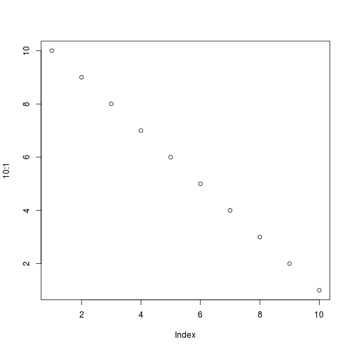

# Workflow of Blender-data post-processing with the blenderFace package 

For using the blenderFace package it is assumed, that you have tracked facial movements for at least two subjects, following the "Step_by_Step_Instructions.pdf". The output of this procedure is a csv file for each participant, which includes the x,y,z-axis movement of the tracked facial markers. Additionally, you need to mark the frames for which a stimulus was presented to the participants. This must be done for each participant (a.k.a. csv file) in a column called "stimulustype" which marks the frames for which a stimulus was presented to the participant (e.g., "posing happiness" or viewing an emotion eliciting film clip). Unfortunately, there is no function or procedure that helps you with this step, because it strongly depends on how you presented the stimuli and how you recorded the video clips of the participants. If you know the start- and stop-frames of the presented stimuli, for example, by recording the computer screen via a mirror in the back of the participant, you can fill in  the stimulustype-colums by hand using a spreadsheet programm. 

The blenderFace package contains raw data sets of two subjects (in fact, it is one subject recorded and tracked twice) which already have the stimulustype-column attached. 

First, be sure to have installed and loaded the package:

```r
install.packages("devtools")
library(devtools)
install_github("axzinker/blenderFace", built_vignettes = TRUE)
library(blenderFace)
```


## Concatenating raw data files to one large RData file with the function *concatBlenderFiles*

To perform the concatenation of files, use the *concatBlenderFiles* function of the package. If you have followed the "Step-by-Step"-instructions, the subject number is part of the file name. However, the file name ends with "_Step_03" for each participant. Please rename the files, so that the subject number is the last number before the filetype ending (e.g., ".csv"). For example, if you have the file "Subject_39_Step_03.csv", rename it into "Subject_39.csv". The package includes two sample csv files in the `./inst/extdata` directory ("Subject_01.csv","Subject_02.csv"). Although the *concatBlenderFiles* function does some basic input checks, be aware that this function writes on your hard disk and may change/overwrite/delete files, if messed up input strings are given!

The path specifications are adapted for the package example. Please change the paths to your needs.


```r
inputdir <- paste(system.file(package = "blenderFace"),"/extdata/",sep="")
outputdir <- paste(system.file(package = "blenderFace"),"/data/",sep="")
filenames <- c("Subject_01.csv","Subject_02.csv")

# If all files in a directory should be processes, use:
# filenames <- list.files(inputdir, pattern = paste("[0-9]",".csv","$",sep=""))

concatBlenderFiles(dataFileNames = filenames, inputDirectory = inputdir, subjectColumn = FALSE, outputFilename = "rawdata.rda", outputDirectory = outputdir, verbose = TRUE)
```

The console output of the *concatBlenderFiles* function shows:


```r
Step 1: Determing unique column names and number of rows of the files to be concatenated.
Reading 2 files:
Reading file Subject_01.csv (1/2)
  Adding 1714 rows to data frame of actually 0 rows.
Reading file Subject_02.csv (2/2)
  Adding 1692 rows to data frame of actually 1714 rows.

The final data frame will have 51 columns and 3406 rows.

These are the unique column names of all files to be concatenated. Check, if they are correct.
 [1] "AU_01_L_x"    "AU_01_L_y"    "AU_01_L_z"    "AU_01_R_x"    "AU_01_R_y"    "AU_01_R_z"    "AU_02_L_x"    "AU_02_L_y"    "AU_02_L_z"   
[10] "AU_02_R_x"    "AU_02_R_y"    "AU_02_R_z"    "AU_06_L_x"    "AU_06_L_y"    "AU_06_L_z"    "AU_06_R_x"    "AU_06_R_y"    "AU_06_R_z"   
[19] "AU_08_x"      "AU_08_y"      "AU_08_z"      "AU_09_L_x"    "AU_09_L_y"    "AU_09_L_z"    "AU_09_R_x"    "AU_09_R_y"    "AU_09_R_z"   
[28] "AU_10_L_x"    "AU_10_L_y"    "AU_10_L_z"    "AU_10_R_x"    "AU_10_R_y"    "AU_10_R_z"    "AU_11_L_x"    "AU_11_L_y"    "AU_11_L_z"   
[37] "AU_11_R_x"    "AU_11_R_y"    "AU_11_R_z"    "AU_12_L_x"    "AU_12_L_y"    "AU_12_L_z"    "AU_12_R_x"    "AU_12_R_y"    "AU_12_R_z"   
[46] "AU_16_x"      "AU_16_y"      "AU_16_z"      "Frame"        "Stimulustype"
Abort Script? (Press 'y' to abort, or any other key to coninue)
? 
Step 2: Concatenating files.

Preallocating data frame of a 51x3406 matrix.
Concatenating file Subject_01.csv (1/2)
Concatenating file Subject_02.csv (2/2)
Step 3: Saving output file (it takes time to save large files).
```

As main output of this function a file with the filename given in `outputFilename` is saved in the directory given in as `outputDirectory`. The data frame stored in this file contains the data of all concatenated subjects. This output file of the two sample subjects is also attached to this package and labeled `rawdata`.

## Scale Blender units to millimeter by using the function *bu2mm*

The next step in Blender data post-processing is to scale the Blender units (BU) into mm. In principle, the rescaling is done by the rule of proportion:
$$latex
\begin{equation*}
  \frac{\mbox{Diameter in Blender units}}{\mbox{Diameter in millimeter}} =
  \mbox{Factor to divide BU by, to obtain mm}
\end{equation*}
$$

For example, a glue dot has a diameter of 8 mm and is measured in Blender with a diameter of 1 BU:

$$latex
\begin{equation*}
  \frac{1 \mbox{ BU}}{8 \mbox{ mm}} = 0.125 \\
  \frac{2 \mbox{ BU}}{0.125} = 16 \mbox{ mm}
\end{equation*}
$$

In the sample videos "Subject_01.mp4" and "Subject_02.mp4" glue-dots with 8 mm diameter were used. To perform the rescaling for the `rawdata` dataset, the glue-dot diameter measurements in BU for each participant are needed. If you have followed the "Step-by-Step"-instructions, you have measured and saved the glue-dot diameters in BU in a file called "Blender_Scalingdata.csv". For the two example subjects, the file "Blender_Scalingdata.csv" is included in the package and should be loaded to get the scaling parameters. Please note, that the paths used in the example below are specified for the package datasets. Therefore, adapt the paths matching your work environment accordingly.


```r
# Load the file "Blender_Scalingdata.csv"
scaledata <- read.csv(system.file("extdata", "Blender_Scalingdata.csv", package = "blenderFace"), header = TRUE, sep =",")
# Be sure to have the data sorted by subjects
scaledata <- scaledata[with(scaledata, order(scaledata$subject)), ]

# Load the file "rawdata"
data(rawdata, package="blenderFace") # for the package example, please comment out
# load("path/to/your/directory/rawdata.rda") # uncomment and adapt to your work environment
# Be sure to have the data sorted by subjects
rawdata <- rawdata[with(rawdata, order(rawdata$subject)), ]
```

From the loaded data files the relevant information for the *bu2mm* function has to be extracted:


```r
# Determin the dataframe columns which should be scaled:
names(rawdata)
```

```
##  [1] "AU_01_L_x"    "AU_01_L_y"    "AU_01_L_z"    "AU_01_R_x"   
##  [5] "AU_01_R_y"    "AU_01_R_z"    "AU_02_L_x"    "AU_02_L_y"   
##  [9] "AU_02_L_z"    "AU_02_R_x"    "AU_02_R_y"    "AU_02_R_z"   
## [13] "AU_06_L_x"    "AU_06_L_y"    "AU_06_L_z"    "AU_06_R_x"   
## [17] "AU_06_R_y"    "AU_06_R_z"    "AU_08_x"      "AU_08_y"     
## [21] "AU_08_z"      "AU_09_L_x"    "AU_09_L_y"    "AU_09_L_z"   
## [25] "AU_09_R_x"    "AU_09_R_y"    "AU_09_R_z"    "AU_10_L_x"   
## [29] "AU_10_L_y"    "AU_10_L_z"    "AU_10_R_x"    "AU_10_R_y"   
## [33] "AU_10_R_z"    "AU_11_L_x"    "AU_11_L_y"    "AU_11_L_z"   
## [37] "AU_11_R_x"    "AU_11_R_y"    "AU_11_R_z"    "AU_12_L_x"   
## [41] "AU_12_L_y"    "AU_12_L_z"    "AU_12_R_x"    "AU_12_R_y"   
## [45] "AU_12_R_z"    "AU_16_x"      "AU_16_y"      "AU_16_z"     
## [49] "Frame"        "Stimulustype" "subject"
```

```r
# -> Frame, Stimulustype and subject should not be scaled -> removed for variable colNames
colNames <- c("AU_01_L_x", "AU_01_L_y", "AU_01_L_z", "AU_01_R_x", "AU_01_R_y", "AU_01_R_z", "AU_02_L_x", "AU_02_L_y", "AU_02_L_z", "AU_02_R_x", "AU_02_R_y", 
              "AU_02_R_z", "AU_06_L_x", "AU_06_L_y", "AU_06_L_z", "AU_06_R_x", "AU_06_R_y", "AU_06_R_z", "AU_08_x", "AU_08_y", "AU_08_z", "AU_09_L_x",  
              "AU_09_L_y", "AU_09_L_z", "AU_09_R_x", "AU_09_R_y", "AU_09_R_z", "AU_10_L_x", "AU_10_L_y", "AU_10_L_z", "AU_10_R_x", "AU_10_R_y", "AU_10_R_z",  
              "AU_12_L_x", "AU_12_L_y", "AU_12_L_z", "AU_12_R_x", "AU_12_R_y", "AU_12_R_z", "AU_16_x", "AU_16_y", "AU_16_z")

# To not overwrite data, use a new data frame (dataSmm means data scaled in millimeter)
dataSmm <- bu2mm(data = rawdata, colNames = colNames, colNameSubj = "subject", scaleFactor = scaledata$GlueDotDiameter, rwMeasure = 8, verbose = TRUE)
```

```
## Perform scaling to millimeter for subject 1 of 2. 
## Perform scaling to millimeter for subject 2 of 2.
```

```r
# Optionally save data at this stage of analysis
# save(dataSmm, file = "path/to/your/directory/dataSmm.rda")
```

In the output data frame of this function is rescaled, and therefore movements can be interpreted in millimenter.

## Scale facial movements to a standardized face by using the function *face2stdFace*

Sometimes it is useful not to interpret the movements in an absolute measure, such as millimeter, but to be able to compare movements of different face sizes. Imagine, you want to compare the facial expression of a child sample with the facial expression of an adult sample. Because the head sizes of the children are smaller, the facial movements are also smaller, compared to the adult sample. Therefore, the standardization of different face sizes to a standardized face is needed. The function *face2stdFace* performs this step for you. The proportions of the standard face used here are based on biological and artistical resources (*@Rainer: fix me: Literaturangeben?*). In the standardized face the length and the height of the head have each a value of 1, while the left-eye -- right-eye distance and the left-eye -- left-mouth-corner distance are scaled to 1/3 of the face height and face width.

As individual measures for face width and face height, the individual left-eye -- right-eye, and the left-eye -- left-mouth-corner distances are used. If you have followed the "Step-by-Step"-instructions, you have measured and saved the these distances in BU in a file called "Blender_Scalingdata.csv". To have comparable measures for all subjects, first, these distances are scaled from BU into millimenter. Subsequently, the rescaled left-eye -- right-eye distance is used to standardize the x-axis, while the left-eye -- left-mouth-corner distance is used to standaradize the y-axis. Additionally, if the left-mouth-corner -- right-mouth-corner, or the right-eye -- right-mouth-corner distances are given to the function, a mean of the two measures is computed for the x-axis and the y-axis, respectively.

Standardizing the z-axis is not (yet) implemented, mainly due to the lack of an appropriate facial distance measure for scaling the z-axis. As a consequence, the z-axis is omitted in further analyses.

Again, as in function *bu2mm* the rescaling is done via the rule of proportion. In the first step, the left-eye -- right-eye, and the left-eye -- left-mouthcorner distances are scaled to mm to obtain real and comparable measurements for these distances. For example, the glue dot diameter of 8 mm is measured as 0.0228 BU in Blender for a subject, therefore the individual scale factor to rescale into millimenter is 0.00285:
$$latex
\begin{equation*}
  \frac{0.0228\mbox{ BU}}{8\mbox{ mm}} = 0.00285
\end{equation*}
$$
Contiuing the example, if the left-eye -- right-eye distance for that subject is 0.1767 BU, the individual distance in mm is 62 mm.
$$latex
\begin{equation*}
  \frac{0.1716\mbox{ BU}}{0.00285} = 62 \mbox{ mm}
\end{equation*}
$$
In order to receive an individual scale factor for the x-axis, this distance has to be set in proportion to 1/3, the left-eye -- right-eye distance of the standardized face.
$$latex
\begin{equation*}
  \frac{62 \mbox{ mm}}{1/3} = 186
\end{equation*}
$$
This is the factor, the x-axis columns of the dataframe of this subject are divided by to restale them to a standardized face. For example, if the left-mouth-corner -- right-mouth-corner distance is 58 mm, the standardized distance is 0.311828 and therefore smaller than the standardized left-eye -- right-eye distance of 1/3.
$$latex
\begin{equation*}
  \frac{58 \mbox{ mm}}{186} = 0.311828
\end{equation*}
$$
Similarily, the scale factor for the y-axis is compupted.


----------------------------------------------------
----------------------------------------------------
----------------------------------------------------
----------------------------------------------------

*@Axel: fix me:* *Im Beispielvideo falsche Markerbennung (AU_08_R) korrigieren!*

----------------------------------------------------
----------------------------------------------------


The figure sizes have been customised so that you can easily put two images side-by-side. 


```r
plot(1:10)
plot(10:1)
```



You can enable figure captions by `fig_caption: yes` in YAML:

    output:
      rmarkdown::html_vignette:
        fig_caption: yes

Then you can use the chunk option `fig.cap = "Your figure caption."` in **knitr**.

You can write math expressions, e.g. $Y = X\beta + \epsilon$, footnotes^[A footnote here.], and tables, e.g. using `knitr::kable()`.


|                  |  mpg| cyl|  disp|  hp| drat|    wt|  qsec| vs| am| gear| carb|
|:-----------------|----:|---:|-----:|---:|----:|-----:|-----:|--:|--:|----:|----:|
|Mazda RX4         | 21.0|   6| 160.0| 110| 3.90| 2.620| 16.46|  0|  1|    4|    4|
|Mazda RX4 Wag     | 21.0|   6| 160.0| 110| 3.90| 2.875| 17.02|  0|  1|    4|    4|
|Datsun 710        | 22.8|   4| 108.0|  93| 3.85| 2.320| 18.61|  1|  1|    4|    1|
|Hornet 4 Drive    | 21.4|   6| 258.0| 110| 3.08| 3.215| 19.44|  1|  0|    3|    1|
|Hornet Sportabout | 18.7|   8| 360.0| 175| 3.15| 3.440| 17.02|  0|  0|    3|    2|
|Valiant           | 18.1|   6| 225.0| 105| 2.76| 3.460| 20.22|  1|  0|    3|    1|
|Duster 360        | 14.3|   8| 360.0| 245| 3.21| 3.570| 15.84|  0|  0|    3|    4|
|Merc 240D         | 24.4|   4| 146.7|  62| 3.69| 3.190| 20.00|  1|  0|    4|    2|
|Merc 230          | 22.8|   4| 140.8|  95| 3.92| 3.150| 22.90|  1|  0|    4|    2|
|Merc 280          | 19.2|   6| 167.6| 123| 3.92| 3.440| 18.30|  1|  0|    4|    4|

Also a quote using `>`:

> "He who gives up [code] safety for [code] speed deserves neither."
([via](https://twitter.com/hadleywickham/status/504368538874703872))
