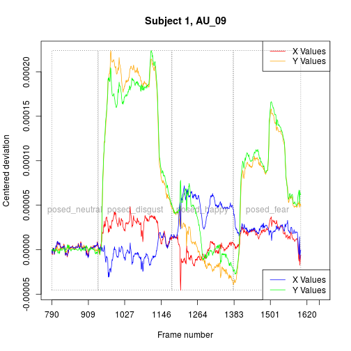
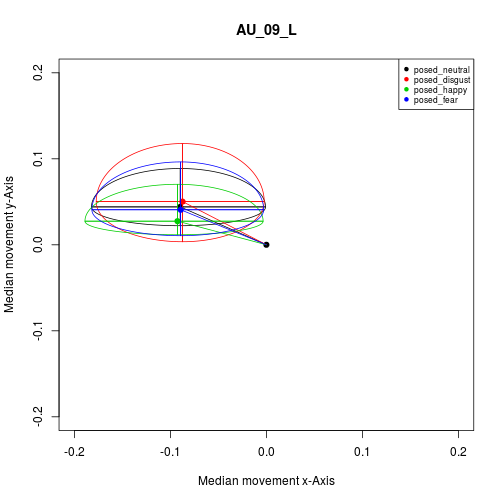
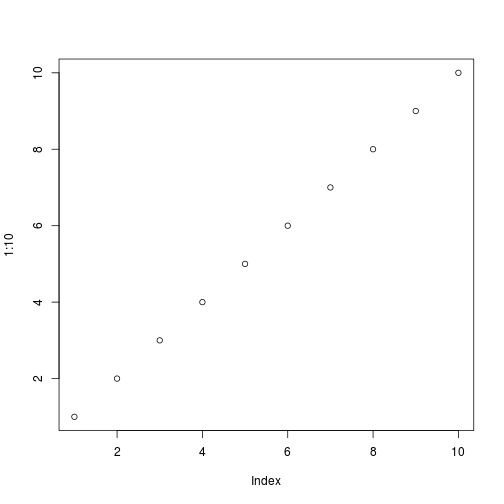

<!-- 
output: rmarkdown::html_vignette 
Build pdf vignette via devtools::build_vignettes()
-->

# Workflow of Blender-data post-processing with the blenderFace package 

For using the `blenderFace` package it is assumed, that you have tracked facial movements for at least two subjects, following the "Step_by_Step_Instructions.pdf". The output of this procedure is a csv file for each participant, which includes the x,y,z-axis movement of the tracked facial markers. Additionally, you need to mark the frames for which a stimulus was presented to the participants. This must be done for each participant (a.k.a. csv file) in a column, for example labelled "Stimulustype", which marks the frames for which a stimulus was presented to the participant (e.g., "posing happiness" or viewing a specific emotion eliciting film clip). Unfortunately, there is no procedure or function that helps you with this step, because it depends strongly on how you presented the stimuli, and how you recorded the participant's video clips. If you know the start- and stop-frames of the presented stimuli, for example, by recording the computer screen via a mirror in the back of the participant, you can fill in  the stimulustype-colums by hand using a spreadsheet programm. Make sure, that each stimulus condition label occurs only once per subject.

The `blenderFace` package comes with raw data sets of two subjects (in fact, it is one subject recorded and tracked twice) which already have the stimulustype-column attached. 

First, be sure to have installed and loaded the package:

```r
install.packages("devtools")
library(devtools)
install_github("axzinker/blenderFace", built_vignettes = TRUE)
library(blenderFace)
```


## Overview of the package functions

The functions of the `blenderFace` package can be divided into three types, which should be applied subsequently:

* Functions to process Blenders raw data:
    + `concatBlenderFiles`: concatenate Blender files into one large RData-file
    + `bu2mm`: scale the Blender data into millimeter
    + `face2stdFace`: scale the Blender data into a standardized face
    + `centerCond`: set the start values of markers to x = 0, y = 0 at the begin of each stimulus presentation
* Functions to visualize the data:
    + `plotXYmmpf`: plot the X/Y marker movement per frame
    + `plotXhead`: plot the data on a standardized face
    + `plotIndmm`: plot individual mean marker movement
    + `plotMmpCond`: plot aggregated marker movement per stimulus condition
* Functions to compute higher order variables:
    + `angleDistance`: compute the angle and the distance of median marker movement

# Functions to process Blenders raw data

## Concatenating Blenders raw data files to a single RData file with the function `concatBlenderFiles`

To perform the concatenation of Blenders csv output files, use the `concatBlenderFiles` function. If you have followed the "Step-by-Step"-instructions, the subject number is part of the file name. However, the file name ends with "_Step_03" for each participant. Please rename the files, so that the subject number is the last number before the filetype ending (e.g., ".csv"). For example, if you have the file "Subject_39_Step_03.csv", rename it into "Subject_39.csv". The package includes two sample csv files in the `./inst/extdata` directory ("Subject_01.csv","Subject_02.csv"). Although the `concatBlenderFiles` function does some basic input checks, be aware that this function writes on your hard disk and may change/overwrite/delete files, if messed up input strings are given!

The path specifications are adapted for the package example. Please change the paths according to your needs.


```r
inputdir <- paste(system.file(package = "blenderFace"),"/extdata/",sep="")
outputdir <- paste(system.file(package = "blenderFace"),"/data/",sep="")
filenames <- c("Subject_01.csv","Subject_02.csv")

# If all files in a directory should be processes, use:
# filenames <- list.files(inputdir, pattern = paste("[0-9]",".csv","$",sep=""))

concatBlenderFiles(dataFileNames = filenames, inputDirectory = inputdir, 
                   colNameSubj = "", outputFilename = "rawdata.rda", 
                   outputDirectory = outputdir, verbose = TRUE)
```

The console output of the `concatBlenderFiles` function for the two sample data files shows:


```r
Step 1: Determing unique column names and number of rows of the files to be concatenated. 
Reading 2 files: 
Reading file Subject_01.csv (1/2) 
  Adding 1714 rows to data frame of actually 0 rows. 
Reading file Subject_02.csv (2/2) 
  Adding 1692 rows to data frame of actually 1714 rows. 

The final data frame will have 51 columns and 3406 rows. 

These are the unique column names of all files to be concatenated. Check, if they are correct. 
 [1] "AU_01_L_x"    "AU_01_L_y"    "AU_01_L_z"    "AU_01_R_x"    "AU_01_R_y"    "AU_01_R_z"   
 [7] "AU_02_L_x"    "AU_02_L_y"    "AU_02_L_z"    "AU_02_R_x"    "AU_02_R_y"    "AU_02_R_z"   
[13] "AU_06_L_x"    "AU_06_L_y"    "AU_06_L_z"    "AU_06_R_x"    "AU_06_R_y"    "AU_06_R_z"   
[19] "AU_08_x"      "AU_08_y"      "AU_08_z"      "AU_09_L_x"    "AU_09_L_y"    "AU_09_L_z"   
[25] "AU_09_R_x"    "AU_09_R_y"    "AU_09_R_z"    "AU_10_L_x"    "AU_10_L_y"    "AU_10_L_z"   
[31] "AU_10_R_x"    "AU_10_R_y"    "AU_10_R_z"    "AU_11_L_x"    "AU_11_L_y"    "AU_11_L_z"   
[37] "AU_11_R_x"    "AU_11_R_y"    "AU_11_R_z"    "AU_12_L_x"    "AU_12_L_y"    "AU_12_L_z"   
[43] "AU_12_R_x"    "AU_12_R_y"    "AU_12_R_z"    "AU_16_x"      "AU_16_y"      "AU_16_z"     
[49] "Frame"        "Stimulustype"
Abort Script? (Press 'y' to abort, or any other key to coninue) 
? 
Step 2: Concatenating files. 

Preallocating data frame of a 51x3406 matrix. 
Concatenating file Subject_01.csv (1/2) 
Concatenating file Subject_02.csv (2/2) 
Step 3: Saving output file (saving large data files takes some time). 
```

As main output of this function a file with the filename given in `outputFilename` parameter is saved in the directory given in as `inputDirecotry`, or given in the `outputDirectory` parameter, if given. The data frame stored in this file contains the data of all concatenated input data files. The output file of the two sample subjects attached to the `blenderFace` package is also attached to this package and labeled `rawdata`.

The correct spelling of the columns (= tracked markers) of the input data files is alread performed by the `concatBlenderFiles` function. It is also meaningful, to check the stimulus conditions for correctness. This can be done with standard R code:


```r
table(rawdata$Stimulustype, rawdata$subject)
```

```
##                
##                   1   2
##                 863 791
##   posed_disgust 215 240
##   posed_fear    235 220
##   posed_happy   215 200
##   posed_neutral 186 241
```

Since the labels used for the stimulus episodes are equal for both participants (e.g., no misspellings), the file `rawdata` can be used source for further scaling, testing, and statistical analyses.

## Scale Blender units to millimeter by using the function `bu2mm`

The movements of the facial markers (respectively the x,y, and z- coordinates) measured with the Blender procedure are scaled in Blender Units (BU). One BU should roughly correspond to one meter in reality, however, Blenders scaling algorithm is fairly arbitrary. If you have followed the "Step-by-Step"-instructions, you have also generated a file called "Blender_Scalingdata.csv", which contains scaling parameters (e.g., the glue dot diameter). These parameters can be used to rescale the BU into millimeter. In principle, the rescaling is done by the rule of proportion:
<!-- aligned works for both, html and pdf output:
https://stackoverflow.com/questions/31161437/how-to-use-eqnarray-in-r-markdown-for-both-html-and-pdf-output
-->
$$
\begin{aligned}
  \frac{\mbox{Diameter in Blender units}}{\mbox{Diameter in millimeter}} =
  \mbox{Factor to divide BU by, to obtain mm}
\end{aligned}
$$

For example, a glue dot has a diameter of 8 mm and is measured in Blender with a diameter of 1 BU:

$$
\begin{aligned}
  \frac{1 \mbox{ BU}}{8 \mbox{ mm}} = 0.125 \\
  \frac{2 \mbox{ BU}}{0.125} = 16 \mbox{ mm}
\end{aligned}
$$

In the sample videos "Subject_01.mp4" and "Subject_02.mp4" glue-dots with 8 mm diameter were used. To perform the rescaling for the `rawdata` dataset, the glue-dot diameter measurements in BU for each participant are needed. For the two example subjects, the file "Blender_Scalingdata.csv" is included in the package and should be loaded to get access to the scaling parameters. Please note, that the paths used in the example below are specified for the package datasets. Therefore, please adapt the paths matching to your work environment accordingly.


```r
# Load the file "Blender_Scalingdata.csv"
scaledata <- read.csv(system.file("extdata", "Blender_Scalingdata.csv", 
                                  package = "blenderFace"), header = TRUE, sep =",")
# For matching reasons, make sure to have the data sorted by subjects
scaledata <- scaledata[with(scaledata, order(scaledata$subject)), ]
```

To scale BU into millimeter, only the glue dot diameter measured in blender is needed. The column name of this parameter is `GlueDotDiameter` and can be determined by:


```r
# Geting the column names of the scaledata dataframe
names(scaledata)
```

```
## [1] "subject"                           
## [2] "GlueDotDiameter"                   
## [3] "PupilPupilDistance"                
## [4] "MouthcornerMouthcornerDistance"    
## [5] "LeftPupilLeftMouthcornerDistance"  
## [6] "RightPupilRightMouthcornerDistance"
## [7] "Comment"
```

Subsequently, load the `rawdata` data file generated by the function `concatBlenderFiles`.


```r
# Load the file "rawdata"
data(rawdata, package="blenderFace") # for the package example, please comment out
# load("path/to/your/directory/rawdata.rda") # uncomment and adapt to your work environment
# For matching reasons, make sure to have the data sorted by subjects
rawdata <- rawdata[with(rawdata, order(rawdata$subject)), ]
```

Not all columns of the `rawdata` data frame must be rescaled (e.g., the subject or the frames column). Therefore, the column names of the columns which should be rescaled must be passed to the function via the `colNames` parameter.


```r
# Determin the dataframe columns which should be scaled:
names(rawdata)
```

```
##  [1] "AU_01_L_x"    "AU_01_L_y"    "AU_01_L_z"    "AU_01_R_x"   
##  [5] "AU_01_R_y"    "AU_01_R_z"    "AU_02_L_x"    "AU_02_L_y"   
##  [9] "AU_02_L_z"    "AU_02_R_x"    "AU_02_R_y"    "AU_02_R_z"   
## [13] "AU_06_L_x"    "AU_06_L_y"    "AU_06_L_z"    "AU_06_R_x"   
## [17] "AU_06_R_y"    "AU_06_R_z"    "AU_08_x"      "AU_08_y"     
## [21] "AU_08_z"      "AU_09_L_x"    "AU_09_L_y"    "AU_09_L_z"   
## [25] "AU_09_R_x"    "AU_09_R_y"    "AU_09_R_z"    "AU_10_L_x"   
## [29] "AU_10_L_y"    "AU_10_L_z"    "AU_10_R_x"    "AU_10_R_y"   
## [33] "AU_10_R_z"    "AU_11_L_x"    "AU_11_L_y"    "AU_11_L_z"   
## [37] "AU_11_R_x"    "AU_11_R_y"    "AU_11_R_z"    "AU_12_L_x"   
## [41] "AU_12_L_y"    "AU_12_L_z"    "AU_12_R_x"    "AU_12_R_y"   
## [45] "AU_12_R_z"    "AU_16_x"      "AU_16_y"      "AU_16_z"     
## [49] "Frame"        "Stimulustype" "subject"
```

```r
# -> Frame, Stimulustype and subject should not be scaled -> removed for variable colNames
colNames <- c("AU_01_L_x", "AU_01_L_y", "AU_01_L_z", "AU_01_R_x", "AU_01_R_y", "AU_01_R_z", 
              "AU_02_L_x", "AU_02_L_y", "AU_02_L_z", "AU_02_R_x", "AU_02_R_y", "AU_02_R_z", 
              "AU_06_L_x", "AU_06_L_y", "AU_06_L_z", "AU_06_R_x", "AU_06_R_y", "AU_06_R_z", 
              "AU_08_x", "AU_08_y", "AU_08_z", 
              "AU_09_L_x",  "AU_09_L_y", "AU_09_L_z", "AU_09_R_x", "AU_09_R_y", "AU_09_R_z", 
              "AU_10_L_x", "AU_10_L_y", "AU_10_L_z", "AU_10_R_x", "AU_10_R_y", "AU_10_R_z",
              "AU_11_L_x", "AU_11_L_y", "AU_11_L_z", "AU_11_R_x", "AU_11_R_y", "AU_11_R_z",
              "AU_12_L_x", "AU_12_L_y", "AU_12_L_z", "AU_12_R_x", "AU_12_R_y", "AU_12_R_z", 
              "AU_16_x", "AU_16_y", "AU_16_z")

# To not overwrite existing data, use a new data frame 
# (dataSmm means data scaled in millimeter)
dataSmm <- bu2mm(data = rawdata, colNames = colNames, colNameSubj = "subject", 
                 scaleFactor = scaledata$GlueDotDiameter, rwMeasure = 8, verbose = TRUE)
```

```
## Perform scaling to millimeter for subject 1 of 2. Individual scale factor is 0.005282. 
## Perform scaling to millimeter for subject 2 of 2. Individual scale factor is 0.006371.
```

```r
# Optionally, save data at this stage of analysis
save(dataSmm, file = "path/to/your/directory/dataSmm.rda")
```

The data frame `dataSmm` which is included in the package is scaled into millimeter. If this data frame is used in other functions, e.g., the median distance of a marker movement can be interpreted in millimeter.

## Scale facial movements to a standardized face by using the function `face2stdFace`

However, it sometimes may not be useful to scale the movements into an absolute measure, such as millimeter. Instead, it may be better to standardize the movements in relation to a standardized face. Imagine, you want to compare the facial expressions of a child sample with the facial expressions of an adult sample. Because the head sizes of the children are smaller, the facial movements of the cildren are also smaller, compared to the adult sample. Therefore, the standardization of different face sizes with respect to a standard face is important. The function `face2stdFace` performs the standardization of individual face sizes to a standard face. The proportions of the standard face used here are based on biological and artistic resources (*@Rainer: fix me: Literaturangaben?*). In the standardized face the length and the height of the head have each a value of 1, while the left-pupil -- right-pupil distance and the left-pupil -- left-mouth-corner distance are scaled to 1/3rd of the face height and face width.

As individual measures for face width and face height, the individual left-pupil -- right-pupil, and the left-pupil -- left-mouth-corner distances are used. If you have followed the "Step-by-Step"-instructions, you have measured and saved these distances in the file "Blender_Scalingdata.csv". To have comparable measures for all subjects, the left-pupil -- right-pupil distance and the left-pupil -- left-mouth-corner distance are set in proportion to 1/3rd to achieve a factor by which the x-axis and the y-axis must be divided, to obtain a standardized scaling. Additionally, if the left-mouth-corner -- right-mouth-corner distance or the right-pupil -- right-mouth-corner distance are given, the `face2stdFace` function allows to compute a mean of these distances for rescaling the x-, and the y-axis to have a more reliable distance measure. However, to our experience, the mouth corner distance ist not such an reliable measure as the pupil distance is.

Standardizing the z-axis is not (yet) implemented, mainly due to the lack of an appropriate facial distance measure for rescaling the z-axis. As a consequence, at the moment no meaningful rescaling of the z-axis is possible. Therefore the z-axis is omitted for further analyses.

Similarly to function `bu2mm`, the rescaling is done via the rule of proportion. For subject 1 in the example data in the file "Blender_Scalingdata.csv", the left-pupil -- right-pupil distance is measured with 0.3346 BU in Blender. This distance is set in proportion to 1/3 to obtain a scaling factor for the x-axis.
$$
\begin{aligned}
  \frac{0.3346\mbox{ BU}}{0.\bar{3}} = 1.0038
\end{aligned}
$$
as scale factor for the x-axis. The left-pupil -- left-mouth-corner distance for subject 1 is measured with 0.36611 BU. Therefore, the scale factor for the y-axis is
$$
\begin{aligned}
  \frac{0.36611\mbox{ BU}}{0.\bar{3}} = 1.09833
\end{aligned}
$$

If not yet performed, load the files `scaledata` and `rawdata`  into Rs environment:

```r
# Load the file "Blender_Scalingdata.csv"
scaledata <- read.csv(system.file("extdata", "Blender_Scalingdata.csv", 
                                  package = "blenderFace"), header = TRUE, sep =",")
# Make sure to have the data sorted by subjects
scaledata <- scaledata[with(scaledata, order(scaledata$subject)), ]

# Load the file "rawdata"
data(rawdata, package="blenderFace") # for the package example, please comment out
# load("path/to/your/directory/rawdata.rda") # uncomment and adapt to your work environment
# Make sure to have the data sorted by subjects
rawdata <- rawdata[with(rawdata, order(rawdata$subject)), ]
```

Subsequently, prepare the parameters and call the function `face2stdFace`:

```r
# Geting the column names of the scaledata dataframe
names(scaledata)
```

```
## [1] "subject"                           
## [2] "GlueDotDiameter"                   
## [3] "PupilPupilDistance"                
## [4] "MouthcornerMouthcornerDistance"    
## [5] "LeftPupilLeftMouthcornerDistance"  
## [6] "RightPupilRightMouthcornerDistance"
## [7] "Comment"
```

```r
# Determin the dataframe columns which should be scaled:
names(rawdata)
```

```
##  [1] "AU_01_L_x"    "AU_01_L_y"    "AU_01_L_z"    "AU_01_R_x"   
##  [5] "AU_01_R_y"    "AU_01_R_z"    "AU_02_L_x"    "AU_02_L_y"   
##  [9] "AU_02_L_z"    "AU_02_R_x"    "AU_02_R_y"    "AU_02_R_z"   
## [13] "AU_06_L_x"    "AU_06_L_y"    "AU_06_L_z"    "AU_06_R_x"   
## [17] "AU_06_R_y"    "AU_06_R_z"    "AU_08_x"      "AU_08_y"     
## [21] "AU_08_z"      "AU_09_L_x"    "AU_09_L_y"    "AU_09_L_z"   
## [25] "AU_09_R_x"    "AU_09_R_y"    "AU_09_R_z"    "AU_10_L_x"   
## [29] "AU_10_L_y"    "AU_10_L_z"    "AU_10_R_x"    "AU_10_R_y"   
## [33] "AU_10_R_z"    "AU_11_L_x"    "AU_11_L_y"    "AU_11_L_z"   
## [37] "AU_11_R_x"    "AU_11_R_y"    "AU_11_R_z"    "AU_12_L_x"   
## [41] "AU_12_L_y"    "AU_12_L_z"    "AU_12_R_x"    "AU_12_R_y"   
## [45] "AU_12_R_z"    "AU_16_x"      "AU_16_y"      "AU_16_z"     
## [49] "Frame"        "Stimulustype" "subject"
```

```r
# Exclude the columns "Frame"", "Stimulustype", "subject" and z-axis columns
colNames <- c("AU_01_L_x", "AU_01_L_y", "AU_01_R_x", "AU_01_R_y", 
              "AU_02_L_x", "AU_02_L_y", "AU_02_R_x", "AU_02_R_y", 
              "AU_06_L_x", "AU_06_L_y", "AU_06_R_x", "AU_06_R_y", 
              "AU_08_x", "AU_08_y", 
              "AU_09_L_x", "AU_09_L_y", "AU_09_R_x", "AU_09_R_y", 
              "AU_10_L_x", "AU_10_L_y", "AU_10_R_x", "AU_10_R_y",  
              "AU_11_L_x", "AU_11_L_y", "AU_11_R_x", "AU_11_R_y",
              "AU_12_L_x", "AU_12_L_y", "AU_12_R_x", "AU_12_R_y", 
              "AU_16_x", "AU_16_y")

# To not overwrite existing data, use a new data frame 
# (dataStdF means data of standaradized faces)
dataStdF <- face2stdFace(data = rawdata, colNames = colNames, colNameSubj = "subject", 
                         pupilDist = scaledata$PupilPupilDistance, 
                         leftPMDist = scaledata$LeftPupilLeftMouthcornerDistance)
```


```r
# Optionally save data at this stage of analysis
save(dataStdF, file = "path/to/your/directory/dataStdF.rda")
```

## Center the start values of the markers per stimulus condition with the function `centerCond`

Because the markers painted on the participant's face are not exactly at the same positions for all participants (e.g., because participant's faces differ in their shape and size, markers drawn by different experimenters, etc.), it is meaningful to center the start values for the markers at x = 0, y = 0 and z = 0 at the begin of each stimulus episode. This allows to aggregate facial movements over participants or compare marker movements of participants for different stimulus episodes, since the movement starts always from the same origin. Otherwise a very standardized, accurate and time consuming marker drawing procedure would have been necessary. However, the extent and direction of the marker movement is not affected by the centering procedure. Technically, the function `centerCond` sets the first frame of each stimulus episode (e.g., the “posing happiness” episode in the "stimulustype" column of the example data frames) to x/y/z = 0 and substracts the offset of the first frame from all remainig frames of this stimulus episode. Because the procedure is computationally very intensive for larger data sets (~ 100 participants, video clips ~ 10 minutes, several stimulus conditions), the function is parallelized and runs on $n-1$ CPU-cores. Nevertheless, it may take a time. Use the `verbose` option to get feedback of the progress of this function.


```r
colNames <- c("AU_01_L_x", "AU_01_L_y", "AU_01_R_x", "AU_01_R_y", 
              "AU_02_L_x", "AU_02_L_y", "AU_02_R_x", "AU_02_R_y", 
              "AU_06_L_x", "AU_06_L_y", "AU_06_R_x", "AU_06_R_y", 
              "AU_08_x", "AU_08_y", 
              "AU_09_L_x", "AU_09_L_y", "AU_09_R_x", "AU_09_R_y", 
              "AU_10_L_x", "AU_10_L_y", "AU_10_R_x", "AU_10_R_y",  
              "AU_11_L_x", "AU_11_L_y", "AU_11_R_x", "AU_11_R_y",  
              "AU_12_L_x", "AU_12_L_y", "AU_12_R_x", "AU_12_R_y", 
              "AU_16_x", "AU_16_y")
# To not overwrite existing data, use a new data frame 
# (dataStdFCen means data of standaradized faces, centered)
dataStdFCen <- centerCond(dataStdF, colNames = colNames, colNameSubj = "subject", 
                          colNameFrames = "Frame", colNameCond = "Stimulustype", 
                          verbose = TRUE)
```

```
## Starting up CPU-cluster: Using 4 CPU-cores.
## Step 1: Getting condition start frames per subject.
## Step 2: Getting offset values per condition per subject.
## Step 3: Subtracting offset values per condition per subject.
## Step 4: Replacing centered values in the original data.
## 
## Plausibility check: ColSums of centered start frames per condition should be 0:
## AU_01_L_x AU_01_L_y AU_01_R_x AU_01_R_y AU_02_L_x AU_02_L_y AU_02_R_x 
##         0         0         0         0         0         0         0 
## AU_02_R_y AU_06_L_x AU_06_L_y AU_06_R_x AU_06_R_y   AU_08_x   AU_08_y 
##         0         0         0         0         0         0         0 
## AU_09_L_x AU_09_L_y AU_09_R_x AU_09_R_y AU_10_L_x AU_10_L_y AU_10_R_x 
##         0         0         0         0         0         0         0 
## AU_10_R_y AU_11_L_x AU_11_L_y AU_11_R_x AU_11_R_y AU_12_L_x AU_12_L_y 
##         0         0         0         0         0         0         0 
## AU_12_R_x AU_12_R_y   AU_16_x   AU_16_y 
##         0         0         0         0 
## 
## Time for completing each step of the function:
## Step1: Getting condition start frames per subject: 
## Time difference of 0.12 secs
## Step2: Getting offset values per condition per subject: 
## Time difference of 0.07 secs
## Step3: Subtracting offset values per condition per subject: 
## Time difference of 0.22 secs
## Step4: Replacing centered values in the original data: 
## Time difference of 0.06 secs
## Overall time: 
## Time difference of 0.47 secs
## Shutting down CPU-Cluster
```


```r
# Optionally save data at this stage of analysis
save(dataStdFCen, file = "path/to/your/directory/dataStdFCen.rda")
```
# Functions to visualize data

Since the data file can get quite large, graphical visualizations are a good and practical way to check the (processed) data for plausibility, outliers, artefacts, etc. The `blenderFace` package provides several functions to visualize the data at different levels of aggregation.

## Plot the x- and y-axis movement per marker over the frames with the function `plotXYmmpf`

This function plots the x-, and y-axis movement of a marker per frame for a single participant. The plot may be used to find artefacts (e.g., sliding of a tracker, scratching the facial skin and therefore moving markers, etc.) or rescaling plausibility and errors. The parameter set of this function differes from the parameter sets of the other functions, because it is intended to be used in loops, for example, to generate many plots for the left and right markers of a subject and arrange them togehter on a pdf page.

On the x-axis the frames, and on the y-axis the marker movement is presented. The example below shows movement of the right AU_09 (marker on the right side next to the nose, when viewing at the participant's face) in millimeter for subject 2 and marked with stimulus episodes:


```r
# Selecting data for subject 2
# Additionally, omit untracked frames at the start and the end of the video clip
data_Subj2 <- subset(dataSmm, subset = ((dataSmm$subject == 2) & 
                                          (dataSmm$Frame >= 690)& (dataSmm$Frame <= 1610)))
plotXYmmpf(colFrames = data_Subj2$Frame, colX = data_Subj2$AU_09_R_x, 
           colY = data_Subj2$AU_09_R_y, colCond = data_Subj2$Stimulustype, 
           center = FALSE, title = "Subject 2, AU_09_R")
```


The next example allows to compare left and right movements (e.g., for judging symmetry of the facial expression) via combining two plots with the `overplot` parameter. To achieve an appropriate scaling, use also the `center` switch. Note, that for the left and the right marker the movement on the x-axis aims into the opposite direction.


```r
# Plotting right marker of AU_09 (Centered)
plotXYmmpf(colFrames = data_Subj2$Frame, colX = data_Subj2$AU_09_R_x, 
           colY = data_Subj2$AU_09_R_y, center = TRUE, title = "Subject 1, AU_09")
# Adding left marker of AU09
plotXYmmpf(colFrames = data_Subj2$Frame, colX = data_Subj2$AU_09_L_x, 
           colY = data_Subj2$AU_09_L_y, center = TRUE, color = c("blue", "green"), 
           overplot = TRUE)
```



This function allows also to check, if centering the stimulus episodes via the `centerCond` function worked correcly:

```r
data_Subj2Cen <- subset(dataStdFCen, subset = ((dataStdFCen$subject == 2) & 
                                                 (dataStdFCen$Frame >= 690)& 
                                                 (dataStdFCen$Frame <= 1610)))
plotXYmmpf(colFrames = data_Subj2Cen$Frame, colX = data_Subj2Cen$AU_09_R_x, 
           colY = data_Subj2Cen$AU_09_R_y, colCond = data_Subj2Cen$Stimulustype, 
           center = FALSE, title = "Subject 2, AU_09_R")
```



## Plot the movement of the markers on a standardized head with the function `plotXhead`

This function plots the data of several facial markers for a single-, or for aggregated subjects on a standardized head model. To get meaninful and well scaled plots, it is important to use the functions `face2stdFace` and `centerCond` first. Because the number and the position of markers are different for varying research questions, the starting positions of the markers have to be defined by the parameter `dataPos`. The names and the order of the variables in `dataPos` list must be equal to the names and the order of the columns in the `data` data-frame.


```r
colNames <- c("AU_01_L_x", "AU_01_L_y", "AU_01_R_x", "AU_01_R_y", 
              "AU_02_L_x", "AU_02_L_y", "AU_02_R_x", "AU_02_R_y", 
              "AU_06_L_x", "AU_06_L_y", "AU_06_R_x", "AU_06_R_y", 
              "AU_08_x", "AU_08_y", 
              "AU_09_L_x", "AU_09_L_y", "AU_09_R_x", "AU_09_R_y", 
              "AU_10_L_x", "AU_10_L_y", "AU_10_R_x", "AU_10_R_y",  
              "AU_11_L_x", "AU_11_L_y", "AU_11_R_x", "AU_11_R_y",
              "AU_12_L_x", "AU_12_L_y", "AU_12_R_x", "AU_12_R_y", 
              "AU_16_x", "AU_16_y")

# Select data for plotting (selecting stimulus type and omit z-axis)
data_Subj_happy <- subset(dataStdFCen, subset = (dataStdFCen$Stimulustype == "posed_happy"), 
                          select = c("subject",colNames))
data_Subj_disgust <- subset(dataStdFCen, subset = (dataStdFCen$Stimulustype == "posed_disgust"), 
                            select = c("subject",colNames))

# Define the positions for the markers for the standardized face of x (-1,1) 
# and y (-1,1) size as named list
dataPos <- list(AU_01_L = c(-.3,.7), AU_01_R = c(.3,.7), 
                AU_02_L = c(-.7,.7), AU_02_R = c(.7,.7), 
                AU_06_L = c(-.5,.2), AU_06_R = c(.5,.2), 
                AU_08 = c(0,-.55), 
                AU_09_L = c(-.2,.2), AU_09_R = c(.2,.2), 
                AU_10_L = c(-.2,-.6), AU_10_R = c(.2,-.6), 
                AU_11_L = c(-.2,-.1), AU_11_R = c(.2,-.1), 
                AU_12_L = c(-.3,-.7), AU_12_R = c(.3,-.7), 
                AU_16 = c(0,-.8)) 

# For debugging purposes the marker names and start positions may also be plotted
plotXhead(data = data_Subj_happy[-1], dataPos = dataPos, 
          title = "All Subjects, happy", plotDataPos = TRUE)
```



This function can also be used to compare facial movements in the sense of raw data plots via the `overplot` parameter:

```r
plotXhead(data = data_Subj_happy[-1], dataPos = dataPos, 
          title = "All Subjects, happy (black) vs. disgust (red)")
plotXhead(data = data_Subj_disgust[-1], dataPos = dataPos, overplot = TRUE, color = "red")
```


## Plot individual median movement per participant using the function `plotIndmm`

The plots generated by the function `plotIndmm` may be used to detect individual outliers. For example, it may be possible, that some subjects did not follow the instructions to pose a disgusted face. Based on the plots, these individuals may be identified. Bcause the movement of the markers is most likely not normally distributed, the median of movement is computed and plotted. The subjects can be identified by the subject number plotted next to their median. To unify the scaling use the `xlim` and `ylim` parameters. In the following example the markers at the left and right mouthcorners (AU_12) are used.


```r
plotIndmm(data = data_Subj_happy, colNames = c("AU_12_L_x", "AU_12_L_y"), 
          colNameSubj = "subject", title = "Posed Happy AU_12_L")
plotIndmm(data = data_Subj_happy, colNames = c("AU_12_R_x", "AU_12_R_y"), 
          colNameSubj = "subject", title = "Posed Happy AU_12_R",xlim = c(-.05,.05), 
          ylim = c(-.05,.05), verbose = TRUE)
```

```
## Computing median for subject 1 
## Computing median for subject 2
```

```
## Plotting subject 1 
## Plotting subject 2
```


## Plot aggregated marker movement per stimulus condition using the function `plotMmpCond`

This plot facilitates the comparison of the movement of a marker for different stimulus episodes. The function plots aggregated data of the median movement one or more subjects per marker and per condition. Additionally, distribution quartiles are plotted as ellipses around the median. The median and the quartiles are plottet in different colors for each stimulus episode. To achieve meaningful plots, make sure to have used the function `centerCond` first.


```r
plotMmpCond(data = dataStdFCen, colNames = c("AU_12_L_x", "AU_12_L_y"), 
            colNameCond = "Stimulustype", title = "AU_12_L")
```


<!-- 
plotMmpCond(data = dataStdFCen, colNames = c("AU_12_R_x", "AU_12_R_y"), 
            colNameCond = "Stimulustype", title = "AU_12_R",xlim = c(-.05,.05), 
            ylim = c(-.05,.05), verbose = TRUE)
-->

# Functions to compute higher order variables

## Compute angle and distance per stimulus condition with the function `angleDist`

This function computes the angle in degree and the distance of a marker movement to facilitate the verbal description of the movement in the sense of direction and extent of movement. It is assumed, that the origin of the movement is at x = 0, y = 0, so be sure to have used the function `centerCond` before.
Keep in mind, that the angles are computed in degrees in the mathematical sense. That means, that a movement to the right is around 0 / 360 degrees, a movement upwars is in direction of 90 degrees, a movement to the left is around 180 degrees, and a movement downwards is around 270 degrees.


```r
# Data preparation
data_Subj_happy <- subset(dataSmm, subset = dataSmm["Stimulustype"] == "posed_happy", 
                          select = c("subject",colNames))
data_Subj_disgust <- subset(dataSmm, subset = dataSmm["Stimulustype"] == "posed_disgust", 
                            select = c("subject",colNames))

angleDist(data_Subj_happy, colNames = c("AU_12_L_x", "AU_12_L_y"), 
          colNameSubj = "subject", rndDig = 3)
```

```
##   subject   angle distance
## 1       1 221.398   54.783
## 2       2 218.793   48.896
```

```r
angleDist(data_Subj_happy, colNames = c("AU_12_R_x", "AU_12_R_y"), 
          colNameSubj = "subject", rndDig = 3, verbose = TRUE)
```

```
## Computing angle and distance for subject 1 
## Computing angle and distance for subject 2
```

```
##   subject   angle distance
## 1       1 318.686   51.742
## 2       2 321.329   47.761
```

It also facilitates comparimg the marker movements. For example you could compare the movement of a posed happy facial expression and a posed disgust facial expression for the marker AU_09_L.

Disgust stimulus episode:

| subject|  angle| distance|
|-------:|------:|--------:|
|       1| 150.35|    19.69|
|       2| 139.16|    20.73|

Happy stimulus episode:

| subject|  angle| distance|
|-------:|------:|--------:|
|       1| 169.80|    18.61|
|       2| 152.21|    18.57|

The angles suggest, that the left AU_09 marker is moved rather to the left (to 180 degrees), when posing happines, and rather moving upwards (to 90 degrees), when posing disgust. Because data scaled to mm was used (`dataSmm`) the distance represents median movement in millimeter.
